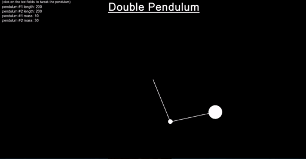

# Double Pendulum in C++
A simple program written in C++ using SFML libraries for demonstrating a double pendulum

# Prerequisites
* In order to compile this, you need to have SFML and CMake installed in your system.

# Compilation
* Run `chmod +x driver.sh` and `./driver.sh`

# Features:
* Click on the textfields to edit the bob mass and rod lengths of each pendulum
* click on any other location to move the pendulum to that location
* Press f to randomize the orientation of the pendulum.

